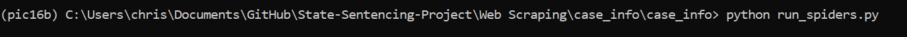
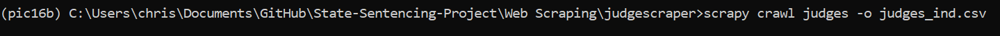

# Spider Tutorial

Before any spiders can be run, Scrapy must be installed in the environment. After cloning the repository, follow these steps for each scrapy project to gather the data.

### The case_info Project

The two spiders that scrape the codes used in the Virginia Case Information System can be run with "scrapy crawl" in the terminal. Make sure to be in the right folder (/State-Sentencing-Project/Web_Scraping/case_info), then write "scrapy crawl {spider name} -o {ouput file name}.csv". However it's probably better to just use the codes already in the repository since the csv files have already been edited for later use.

The spider used to actually get the case information is run from a script instead of "scrapy crawl". In the terminal, navigate to the folder containing the `run_spiders.py` file (.../case_info/case_info), then run the script like normal with the command "python run_spiders.py" or "python3 run_spiders.py" depending on how many versions of python are installed. 

One spider for each circuit court will be created, so at the beginning, 119 spiders should be running concurrently, but the smaller courts will finish much faster and close on their own. As each spider runs, it will be yielding data to its own csv file for 119 csv files in total. Once all the courts are done, which will probably takes about 2 weeks, run the `case_matcher.py` script located in the CSV Processing folder to format the cases and create the database.

### The judgescraper Project

The spiders in the judgescraper project can be run with "scrapy crawl" as seen below. 

The "judges" spider will get judges for most of the courts, and the "judges_missing" spider will get the remaining ~20 courts that were missing. Once the two spiders are done running, `process_judges.py` will convert the judge names into their IDs and combine the separate list from each spider into one judges.csv file.

# Demo
